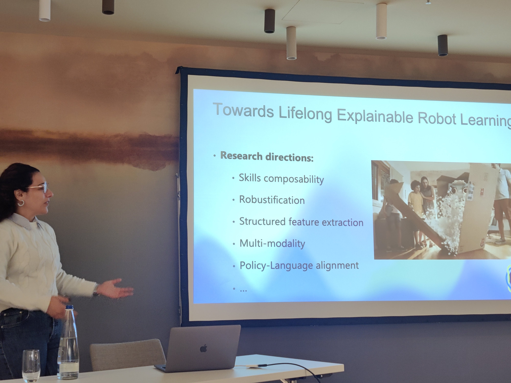
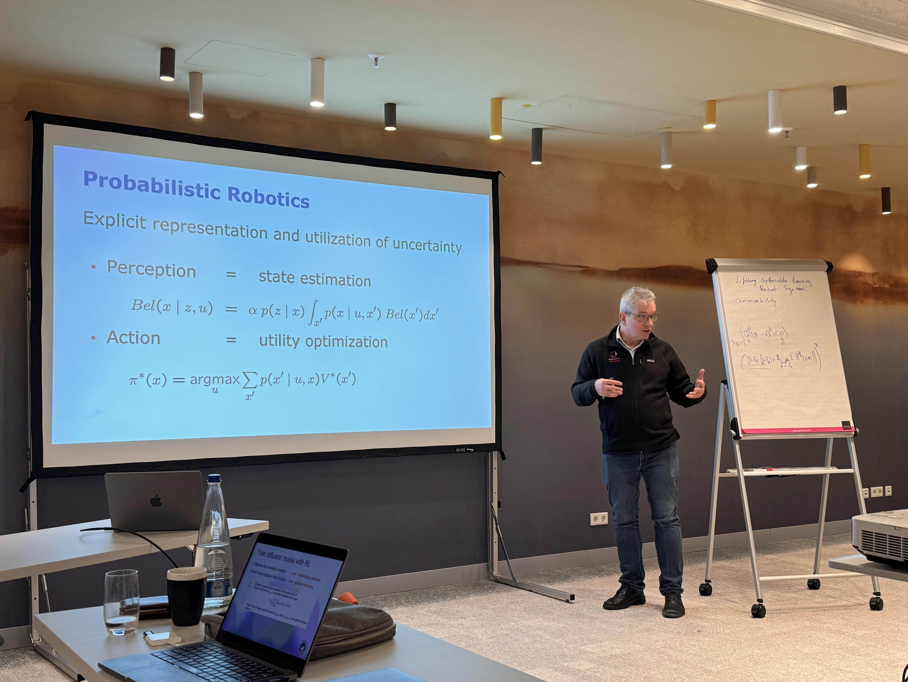
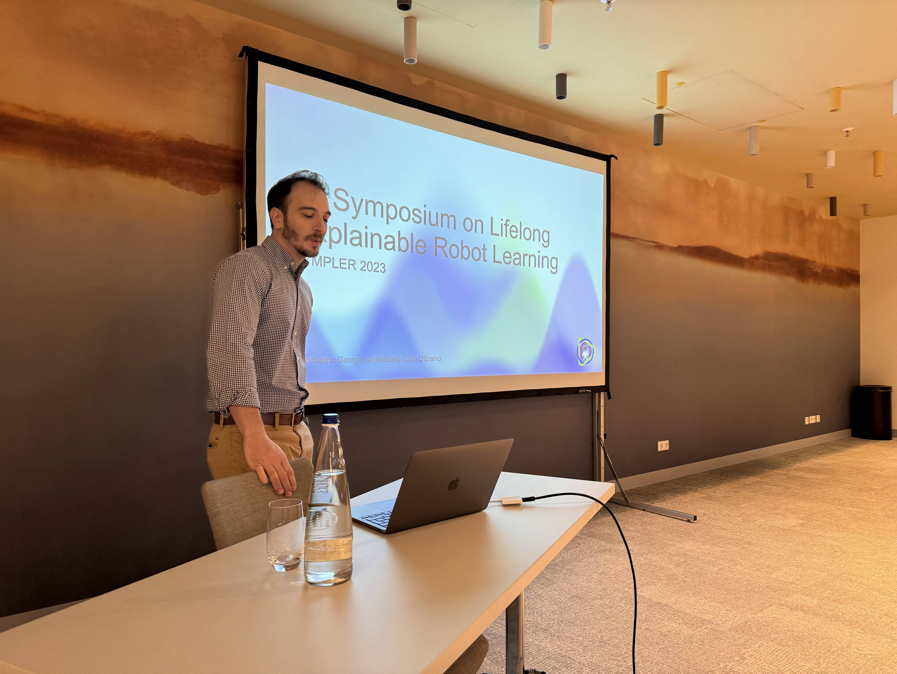
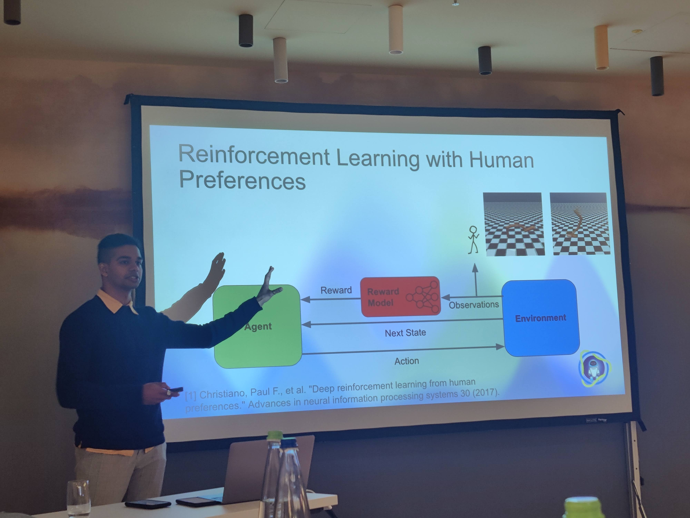

Thanks to the growing presence of robots interacting in human spaces, the need for reliable and safe robot learning systems is greater than ever. The SYMPLER symposium tackled this need by focusing especially on both explainability and lifelong learning, as these are two keys areas in which we can robustify robot learning for human interaction.

We hosted a number of speakers with expertise in the fields of robot learning and reinforcement learning, including the ever-impressive Wolfram Burgard.

<!--  -->


  

    

    
    <figcaption>Georgia's (Head of PEARL) introduction to the symposium.</figcaption>
    

    

    
    <figcaption>
    Wolfram Burgard's presentation on his lab's latest work.</figcaption>
    



Additionally, we got to present our current research projects (and how they might help in some way in the quest towards explainability and lifelong learning in AI systems).


  

    

    
    <figcaption>Carlo's (Head of LiteRL) introduction talk.</figcaption>
    

    

    
    <figcaption>
    Me presenting my projects.</figcaption>
    



We also had a chance to explore the beautiful Christmas markets of Nürnberg, which were an absolute treat.



