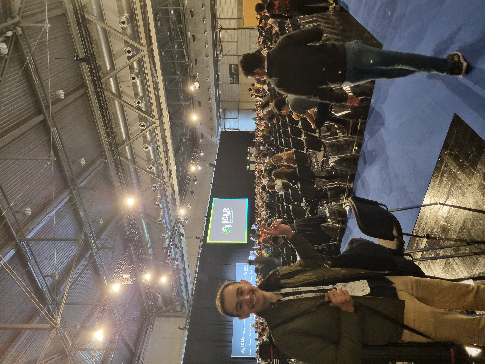
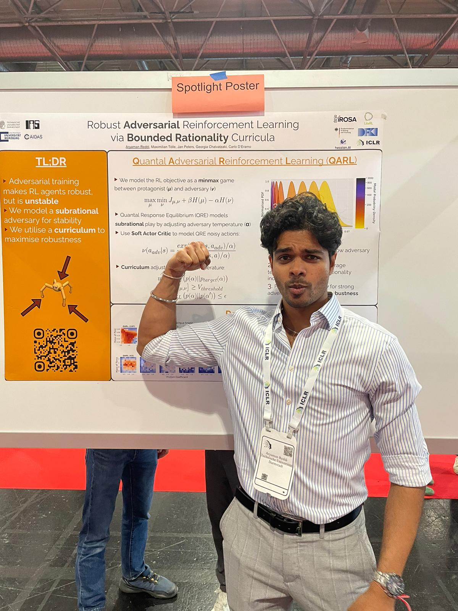
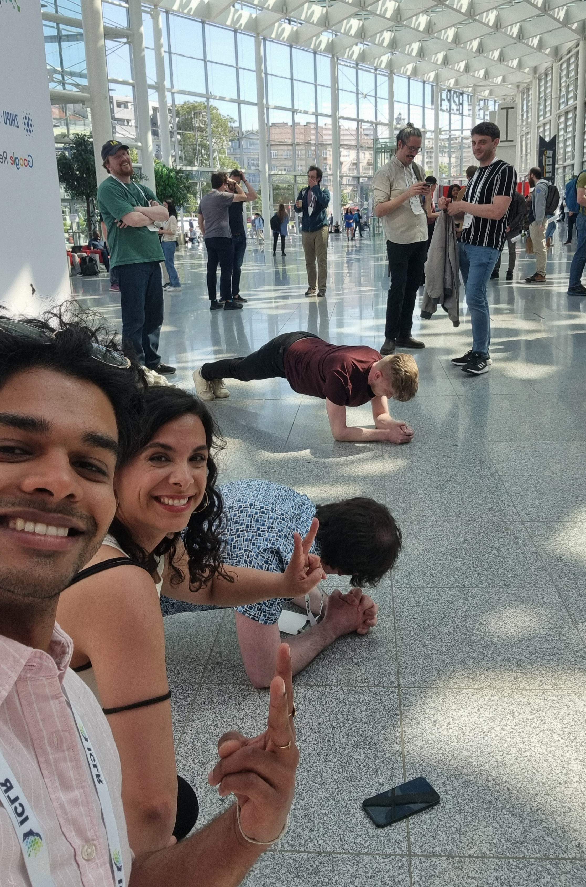
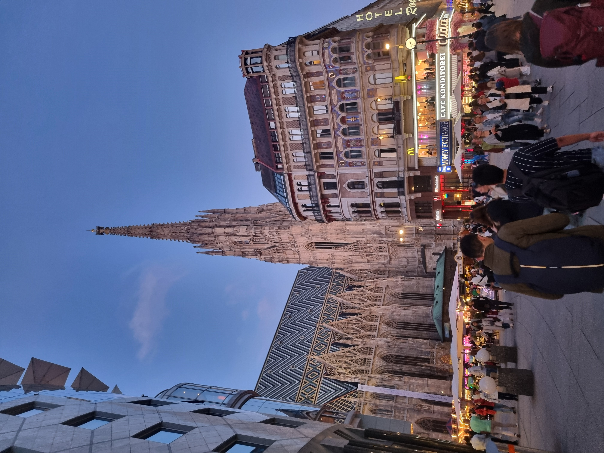

In May 2024, I went to Vienna along with several other researchers from the IAS, LiteRL, and PEARL labs to present our latest works at ICLR, one of the largest deep learning conferences in the world.

I presented my first publication, [Robust Adversarial Reinforcement Learning via Bounded Rationality Curricula](https://arxiv.org/abs/2311.01642), which was accepted as a spotlight poster.

<!--  -->


  

    

    
    <figcaption>Day One: Talking to sponsors!</figcaption>
    

    

    
    <figcaption>
    With my fellow LiteRL PhD student Mahdi Kallel.</figcaption>
    



Additionally, I had the chance to meet dozens of other researchers in the fields of representation learning, game theory, large language models, and just about every other deep learning-adjacent research niche under the sun.


  

    

    
    <figcaption>Just before the poster presentation.</figcaption>
    

    

    
    <figcaption>
    Plank competition!</figcaption>
    



Since this was my first conference, I was blown away by variety of talks that were given and the sheer number of rich conversations I was able to get at the poster sessions and workshops.


    

    
    <figcaption>The beautiful city of Vienna.</figcaption>
    



